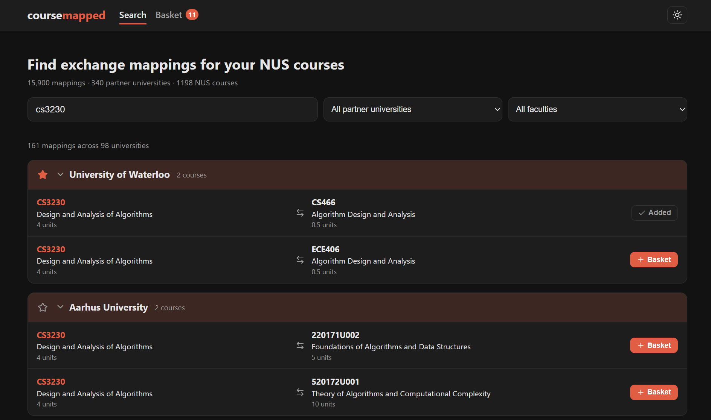

# coursemapped



Search NUS SEP course mappings by course then collect the ones you like grouped by partner university and share it with friends via a link. No login needed.

## Features

- **Search by course**: type an NUS course code (`CS3244`), a title
  (`machine learning`), a partner university course code/title, or a university
  name. Results are grouped by partner university, with an optional
  university filter.
- **Basket**: add mappings to a basket stored in your browser
  (localStorage). View it grouped by partner university; remove single courses
  or a university with all its courses at once.
- **Sharing**: copy a link for your whole basket or for one university's
  courses. The link encodes the courses in the URL itself, so anyone who opens
  it can view them and import them into their own basket.

## Getting started

Requires Node.js 20+.

```bash
npm install
npm run seed     # builds the SQLite database from the scraped CSV + NUSMods API
npm run dev      # API on :3001 + Vite dev server on :5173
```

Open http://localhost:5173.

For a production-style run:

```bash
npm run build    # typecheck + bundle the frontend into dist/
npm start        # Express serves the API and dist/ on :3001
```

## Scripts

| Script | What it does |
| --- | --- |
| `npm run dev` | Run API (tsx watch) and Vite dev server together |
| `npm run seed` | (Re)build the database from `data_scrapping/out/soc_course_mappings.csv`; pass another faculty key with `npm run seed -- fos` |
| `npm run build` | Typecheck all projects and build the frontend |
| `npm start` | Serve the API + built frontend on one port |
| `npm test` | Run the vitest suite |
| `npm run typecheck` | `tsc -b` across app, server and config |

## Data

`data_scraping/` holds the scraper (`scrape_course_mappings.py`) that converts
saved EduRec MHTML pages into the CSVs in `data_scraping/out/`. The seed
script normalises those rows into SQLite and replaces stale NUS course titles
with fresh ones from NUSMods.

## Known Issues
- Mapping data is scraped from EduRec, where mapping data is updated infrequently  and likely to be outdated.

